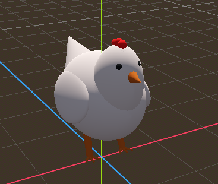
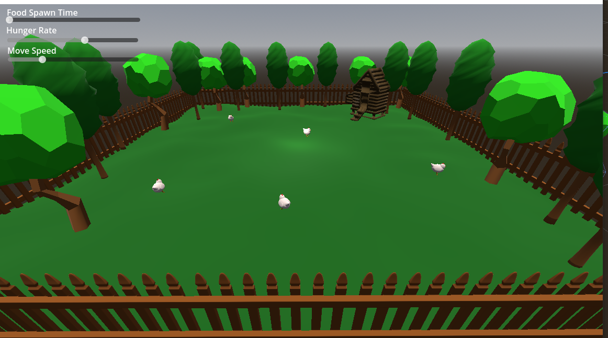

The Chicken Simulation Project

Name: Orin McDonogh

Student Number: C20307673

Class Group: TU856

## Description
This project simulates a chicken's behavior in a dynamic environment. The chickens can walk around, search for food, and mate to produce offspring. The simulation includes interactive UI elements to control various parameters, enhancing the simulation experience.

## Video:

https://youtu.be/SSh3E-arfak

## Screenshots

## Instructions
Open the project in Godot.
Run the MainWorld scene to start the simulation.
Use the sliders in the UI to adjust the food spawn rate and hunger timer.

# How it works
The simulation consists of multiple chickens that exhibit natural behaviors such as walking, searching for food, and mating. The environment includes randomly spawning food objects, which the chickens can find and consume to reduce their hunger levels. When two chickens are close enough and meet certain conditions, they can mate and produce a new chicken.

The project uses various classes and scenes to organize the behaviors and interactions:

Chicken: Handles movement, animations, and interactions such as mating.
Food: Spawns randomly in the environment and can be consumed by chickens.
MainWorld: Manages the overall simulation, including spawning food and chickens.

# List of classes/assets

| Class/asset | Source |
|-----------|-----------|
|MainWorld.gd | Self written |
|Chicken.gd | Self written |
|Food.gd | Self written |
|Coop.gd | Self written |
|fence.obj | Free Model from Free3D |
|grass.obj | Free Model from Free3D |
|tree.obj | Free Model from Free3D |
|coop.obj | Free Model from Free3D |

What I did: I designed and implemented the core simulation mechanics, including chicken behaviors, food spawning, and mating interactions. I also created the UI for controlling various parameters of the simulation.
What I am most proud of: I am most proud of the natural-looking movement and interaction of the chickens, and the flexibility provided by the UI for adjusting the simulation parameters in real-time.
What I learned: I learned a lot about using Godot for creating dynamic simulations and managing complex interactions between multiple entities in a 3D environment. I also improved my skills in creating intuitive user interfaces.

# References
Godot Documentation - https://docs.godotengine.org/en/3.2/index.html

